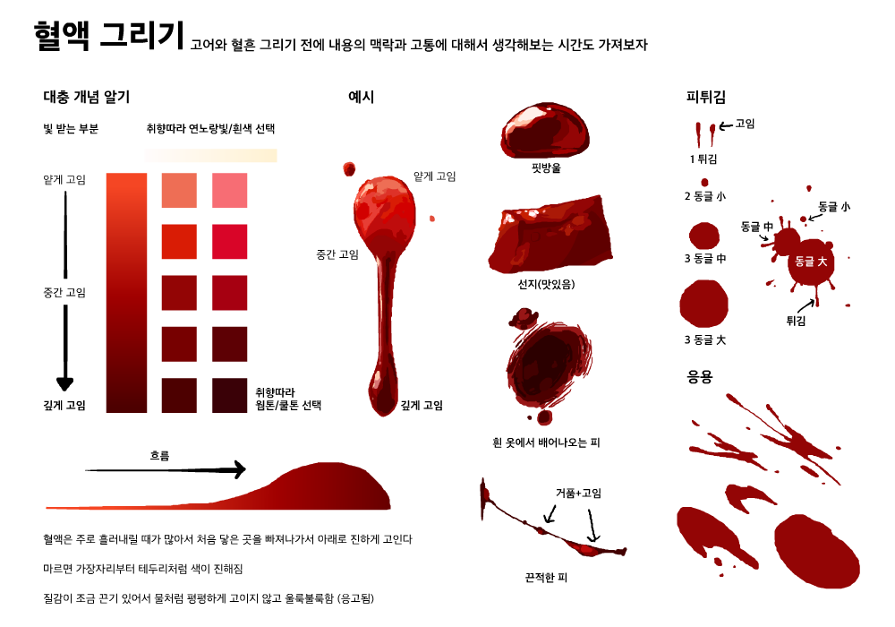

---
hide:
    - navigation
---

# Resources

Here you can find a list of resources curated by [LucidSky](lucidsky.md).

## CSP Brushes

- [rkgk pencil](https://assets.clip-studio.com/en-us/detail?id=1737693)
- [SAI](https://cdn.discordapp.com/attachments/728157089322762301/823040031345606656/SAI_2.sut)

## Line of Action

- [line-of-action.com](https://line-of-action.com/practice-tools/figure-drawing)
- [https://twitter.com/TheFramebyFrame/status/1315669157707485184?s=20](https://twitter.com/TheFramebyFrame/status/1315669157707485184?s=20)

## Girl hairstyle

- [https://twitter.com/ebiebieshrimp/status/1293882693822763008?s=21](https://twitter.com/ebiebieshrimp/status/1293882693822763008?s=21)

## Chin up perspective

- [https://twitter.com/miyuliart/status/1297492560211070977?s=21](https://twitter.com/miyuliart/status/1297492560211070977?s=21)

## Color palette

- [https://twitter.com/miji0328/status/1301865732246892544?s=20](https://twitter.com/miji0328/status/1301865732246892544?s=20)

## Thighs

- [https://twitter.com/tribbutribby/status/1301856689474338817](https://twitter.com/tribbutribby/status/1301856689474338817)

## Torso, arms, legs, hands

- [https://twitter.com/mgong520/status/1335857561203982336?s=21](https://twitter.com/mgong520/status/1335857561203982336?s=21)

## Ruffles

## Blood

